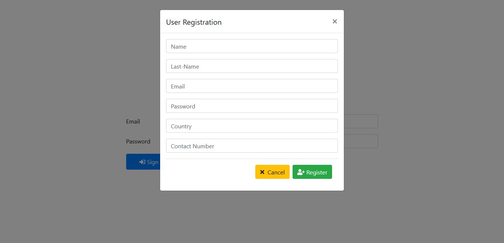
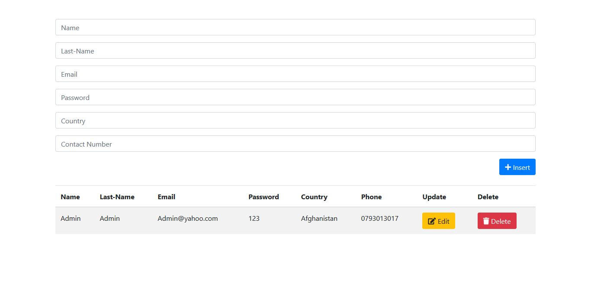

# CRUD-in-PHP

This is just a simple CRUD application in PHP

## Installation

1>Install XAMPP or WAMPP.

2>Open XAMPP Control panal and start [apache] and [mysql] .

3>Download project from github(https://github.com/Humayoon17/CRUD-PHP.git).
 
 OR follow gitbash commands

    i>cd C:\\xampp\htdocs\

    ii>git clone https://github.com/Humayoon17/CRUD-PHP.git

4>extract files in C:\\xampp\htdocs\.

5> open link localhost/phpmyadmin

6>click on new at side navbar.

8>give a database name as (crud) hit on create button.

9>after creating database name click on import.

10>browse the file in directory [database/crud.sql].

11>open any browser and type http://localhost/CRUD-PHP.

12>first register and then login

13>admin login details  Email=admin@yadoo.com and Password=123.

## If you like my project hit a start

## Screenshots

## Contributing
Pull requests are welcome. For major changes, please open an issue first to discuss what you would like to change.

Please make sure to update tests as appropriate.

# Humayoon
# Muhammadi
